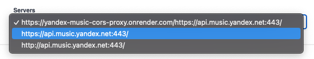

<h1 align="center"><br />yandex-music-open-api</h1>

Swagger документация для Yandex Music.

## Local development

```
npm install
npm start
```

## Прокси сервер

По умолчанию, все запросы отправляются по следующему адресу https://yandex-music-cors-proxy.onrender.com/https://api.music.yandex.net:443/
- https://yandex-music-cors-proxy.onrender.com/ - прокси сервер, используемый для обхода [CORS](https://habr.com/ru/company/macloud/blog/553826/), исходники можно посмотреть [здесь](https://github.com/acherkashin/yandex-music-cors-proxy)
- https://api.music.yandex.net:443/ - адрес Яндекс.Музыки

Если вы не доверяете прокси серверу, то для обхода данной проблемы можно использовать следующий способ запуска Google Chrome. Сначала закройте все инстансы Google Chrome, затем перейдите в папку с Google Chrome и запустите его с флагом `--disable-web-security`. При запуске Google Chrome вы увидите сообщение `Вы используете неподдерживаемый флаг командной строки: -disable-web-security. Стабильность и безопасность будут нарушены.`, данное сообщение можете игнорировать. 

**Mac OS** 

```
open -na Google\ Chrome --args --user-data-dir=/tmp/temporary-chrome-profile-dir --disable-web-security --disable-site-isolation-trials
```

**Windows**

```
cd C:\Program Files (x86)\Google\Chrome\Application
.\Chrome.exe --user-data-dir="C:/Chrome dev session" --disable-web-security
```

После запуска, можете выбрать сервер напрямую адрес Яндекс.Музыки в верхней части схемы - `https://api.music.yandex.net:443/`



### Open API генератор

#### Кастомный request.ts файл 

Необходимо использовать кастомный `request.ts` файл [из-за известного бага в `openapi-typescript-codegen` модуле](https://github.com/ferdikoomen/openapi-typescript-codegen/issues/1000#issuecomment-1374436662).

#### Использование JavaScript Yandex Music Client

Как использовать клиент Яндекс.Музыки для JavaScript [описано здесь]('./lib/README.md').

#### Генерация клиентов с помощью [openapi-generator](https://openapi-generator.tech/docs/usage)

1. Установить [openapi-generator](https://openapi-generator.tech/docs/installation)
2. Скачать **./src/yandex-music.yaml*
3. Выбрать нужный генератор, выбрать можно из списка - `openapi-generator  list`
4. Сгенерировать клиент `openapi-generator generate -i yandex-music.yaml -g csharp-netcore -o ./dotnet-client`, `csharp-netcore` - генератор для C#

## Roadmap

- [x] Опубликовывать Yandex Music Api на хостинг
- [x] Добавить описание использования [OpenAPI Genrator](https://openapi-generator.tech/)
- [ ] Публиковать Npm, Nuget, ... модули
- [ ] Добавить линтер 

## Помощь

Все вопросы касающиеся yandex music api, могут быть заданы в [Telegram чате](https://t.me/yandex_music_api).
Поддержать автора можно подписавшись на его [Telegram канал](https://t.me/cherkashindev).

## Благодарность

Спасибо [MarshalX](https://github.com/MarshalX/), [его работа](https://github.com/MarshalX/yandex-music-api) положена в основу [yandex-music-extension](https://github.com/acherkashin/yandex-music-extension) и [yandex-music-open-api](https://github.com/acherkashin/yandex-music-open-api).
